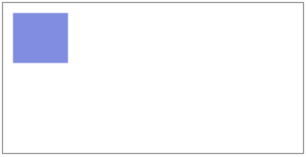

# Refs

### Background: Using Canvas

> A `<canvas>` element works like an artist's canvas. You write JS to paint pixels on it, which get rendered in its fixed-height and fixed-width frame.

Suppose we want to render a canvas containind a filled rectangle, like this:



Here's the HTML:

``` html
<canvas style="border: 1px solid gray">
  (Fallback content for browsers that don't support canvas)
</canvas>
```

This canvas could be rendered (without React) like this:

``` javascript
let canvas = document.getElementById('canvas1');
let ctx = canvas.getContext('2d');
ctx.fillStyle = "rgba(0, 0, 200, 0.5)";
ctx.fillRect(30, 30, 55, 50);
```

It's the `fillRect(x, y, width, height)` call that draws the actual rectangle.

## Lab Exercises

### Using Canvas in React

1. Create a component that renders an HTML `<canvas>` element.

2. Write JS code in your component to draw a blue rectangle into the canvas element, as above.

### [Optional] Writing a Paint Component

1. Extend your component to support "painting". To do this, handle `mouseDown`, `mouseUp` and `mouseMove` events. Only draw the rectangle (`fillRect()`) when the mouse button is down.

    #### Hints

    1. Draw a smaller rectangle (say 5px square).
    2. To compute the coordinates from your mouse events, use:

        ``` javascript
        function getPositionFromEvent(event) {
          let rect = event.target.getBoundingClientRect();
          let x = event.clientX - Math.round(rect.left) - 5;
          let y = event.clientY - Math.round(rect.top) - 5;
          return { x, y };
        }
        ```
    > Using `fillRect()` doesn't give the nicest painting user experience,
      but this is a React course! If you want to take it further,
      investigate `beginPath()`, `lineTo()` and more.

### Troubleshooting

1. If you happen to be testing with Jest (covered later) and you get `"Cannot set property 'fillStyle' of undefined"`, this is because while `jsdom` includes the `<canvas>` element, it defers support for the DOM API to a separate package. Install the package `canvas-prebuilt` and re-run.

